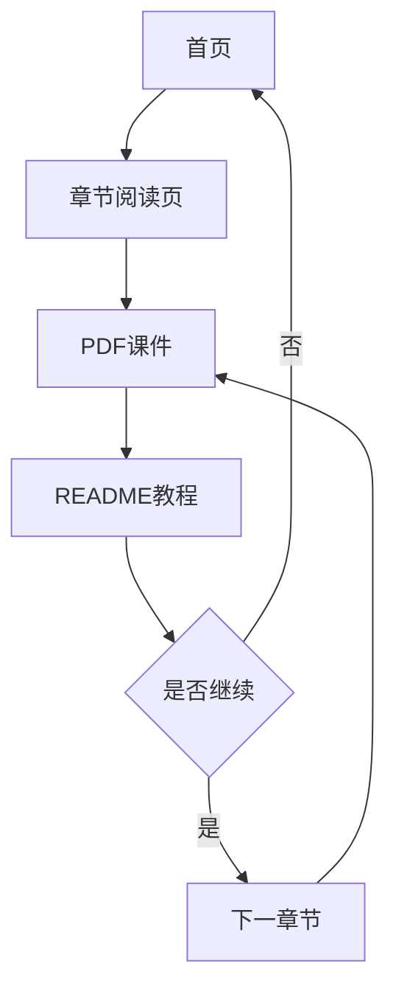

## 1. 产品概述
为GitHub仓库创建一个网页版阅读器，部署在GitHub Pages上。用户可以按顺序阅读documents文件夹中11个Chapter的PDF课件和README.md教程内容。

解决用户在GitHub上直接阅读PDF和Markdown文件体验不佳的问题，提供清晰的学习路径和良好的阅读体验。

## 2. 核心功能

### 2.1 用户角色
无需用户注册，所有访问者都可以免费阅读内容。

### 2.2 功能模块
网页阅读器包含以下核心页面：
1. **首页**：章节导航、学习进度、简介说明
2. **章节阅读页**：PDF课件展示、README教程展示、章节切换
3. **搜索页**：内容搜索、结果展示（可选增强功能）

### 2.3 页面详情
| 页面名称 | 模块名称 | 功能描述 |
|---------|----------|----------|
| 首页 | 章节导航 | 显示11个章节的卡片式导航，包含章节标题和简介 |
| 首页 | 学习进度 | 显示用户已阅读的章节进度（使用localStorage存储） |
| 首页 | 简介说明 | 显示项目简介和使用说明 |
| 章节阅读页 | PDF阅读器 | 内嵌PDF.js展示章节课件，支持缩放、翻页、全屏 |
| 章节阅读页 | Markdown渲染 | 将README.md渲染为HTML，支持代码高亮和数学公式 |
| 章节阅读页 | 内容切换 | 在PDF课件和README教程间切换，保持阅读顺序 |
| 章节阅读页 | 章节导航 | 上一章/下一章快速切换，返回首页 |
| 搜索页 | 搜索框 | 输入关键词搜索章节标题和内容 |
| 搜索页 | 搜索结果 | 显示匹配的章节列表和高亮关键词 |

## 3. 核心流程
用户访问流程：
1. 用户进入首页，看到11个章节的导航卡片
2. 点击任意章节进入阅读页面
3. 首先显示PDF课件，用户阅读完成后切换到README教程
4. 可以继续阅读下一章或返回首页
5. 系统记录阅读进度，下次访问时显示继续阅读提示

## 4. 用户界面设计

### 4.1 设计风格
- **主色调**：深蓝色 (#1e3a8a) 和白色背景
- **辅助色**：浅灰色 (#f3f4f6) 和深灰色 (#374151)
- **按钮样式**：圆角矩形，悬停效果，主要按钮使用主色调
- **字体**：系统字体栈，标题使用粗体，正文字号16px
- **布局风格**：响应式卡片布局，顶部导航栏
- **图标风格**：使用简洁的线性图标

### 4.2 页面设计概述
| 页面名称 | 模块名称 | UI元素 |
|---------|----------|--------|
| 首页 | 章节导航 | 网格布局的卡片，每个卡片显示章节编号、标题、简介和阅读状态图标 |
| 首页 | 学习进度 | 顶部进度条显示整体完成度，卡片上显示单个章节完成状态 |
| 章节阅读页 | PDF阅读器 | 全宽度嵌入，顶部工具栏包含缩放、翻页、全屏按钮 |
| 章节阅读页 | Markdown渲染 | 清晰的排版，代码块使用深色主题，数学公式使用KaTeX渲染 |
| 章节阅读页 | 内容切换 | 标签页式切换，清晰标识PDF课件和README教程 |

### 4.3 响应式设计
- 桌面优先设计，适配1200px以上屏幕
- 平板适配：768px-1199px，调整为2列网格
- 手机适配：小于768px，单列布局，简化导航
- 触摸优化：按钮和交互元素适合触摸操作

### 4.4 性能优化
- 使用CDN加载PDF.js和字体资源
- 图片懒加载和PDF分页加载
- 启用浏览器缓存和压缩
- 使用GitHub Pages的Jekyll优化功能