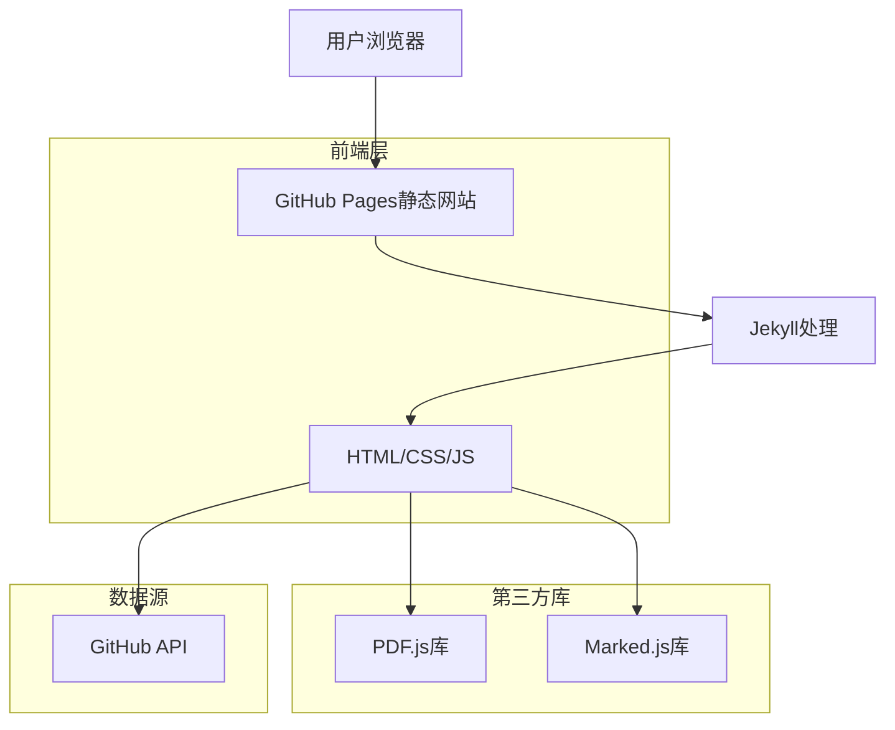

## 1. 架构设计



## 2. 技术描述

- **前端**: Jekyll + HTML5 + CSS3 + JavaScript ES6
- **初始化工具**: Jekyll（GitHub Pages内置支持）
- **PDF渲染**: PDF.js
- **Markdown渲染**: Marked.js + Prism.js（代码高亮）
- **数学公式**: KaTeX
- **CSS框架**: Tailwind CSS（通过CDN）
- **图标**: Font Awesome（通过CDN）
- **后端**: 无（纯静态网站，直接读取GitHub仓库文件）

## 3. 路由定义

| 路由 | 目的 |
|------|------|
| / | 首页，显示11个章节的导航 |
| /chapter-01/ | 第1章阅读页面，包含PDF和Markdown |
| /chapter-02/ | 第2章阅读页面，包含PDF和Markdown |
| ... | ... |
| /chapter-11/ | 第11章阅读页面，包含PDF和Markdown |
| /search/ | 搜索页面（可选功能） |

## 4. 文件结构

```
.github/
  └── workflows/
      └── pages.yml          # GitHub Actions部署配置
docs/
  ├── _layouts/
  │   ├── default.html       # 基础布局模板
  │   └── chapter.html       # 章节页面模板
  ├── _includes/
  │   ├── header.html        # 顶部导航
  │   ├── footer.html        # 底部信息
  │   └── pdf-viewer.html    # PDF阅读器组件
  ├── assets/
  │   ├── css/
  │   │   └── styles.css     # 自定义样式
  │   └── js/
  │       ├── main.js        # 主逻辑
  │       ├── pdf-loader.js  # PDF加载逻辑
  │       └── markdown-loader.js # Markdown加载逻辑
  ├── _config.yml            # Jekyll配置
  └── index.html             # 首页
```

## 5. 核心实现逻辑

### 5.1 文件加载策略
- **PDF文件**: 使用PDF.js通过GitHub raw URL加载
- **Markdown文件**: 使用GitHub API获取文件内容，Marked.js渲染
- **缓存机制**: localStorage存储已加载的内容，减少重复请求

### 5.2 章节数据配置
在 `_config.yml` 中配置章节信息：
```yaml
chapters:
  - number: 1
    title: "深度学习基础"
    description: "神经网络基础概念"
    pdf_path: "documents/Chapter-01/slides.pdf"
    readme_path: "documents/Chapter-01/README.md"
  # ... 其他章节
```

### 5.3 进度跟踪
使用localStorage存储用户阅读进度：
```javascript
// 存储进度
localStorage.setItem('reading-progress', JSON.stringify({
  'chapter-1': { pdf: true, readme: false },
  'chapter-2': { pdf: true, readme: true }
}));
```

## 6. GitHub Pages配置

### 6.1 部署配置
在 `.github/workflows/pages.yml` 中配置自动部署：
```yaml
name: Deploy to GitHub Pages
on:
  push:
    branches: [ main ]
jobs:
  build-and-deploy:
    runs-on: ubuntu-latest
    steps:
    - uses: actions/checkout@v2
    - name: Setup Ruby
      uses: ruby/setup-ruby@v1
      with:
        ruby-version: '3.0'
    - name: Build and Deploy
      uses: helaili/jekyll-action@v2
      with:
        token: ${{ secrets.GITHUB_TOKEN }}
```

### 6.2 Jekyll配置
在 `docs/_config.yml` 中启用必要插件：
```yaml
plugins:
  - jekyll-feed
  - jekyll-sitemap
  
# GitHub Pages特定配置
github:
  repository_url: https://github.com/your-username/your-repo
```

## 7. 性能优化

### 7.1 资源优化
- 使用CDN加载第三方库
- 压缩CSS和JavaScript文件
- 启用Gzip压缩（GitHub Pages自动支持）

### 7.2 加载优化
- PDF文件分页加载
- Markdown内容预加载和缓存
- 图片懒加载

### 7.3 SEO优化
- 添加meta标签
- 生成sitemap.xml
- 优化页面标题和描述